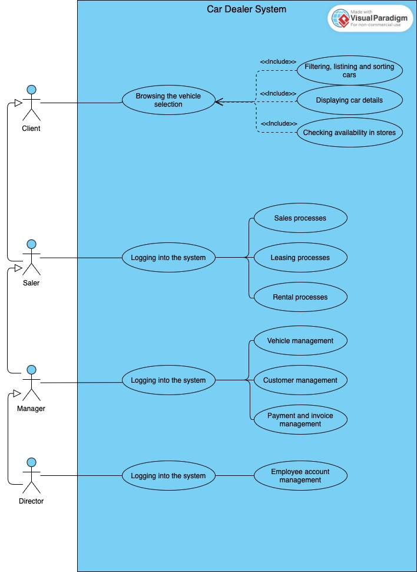
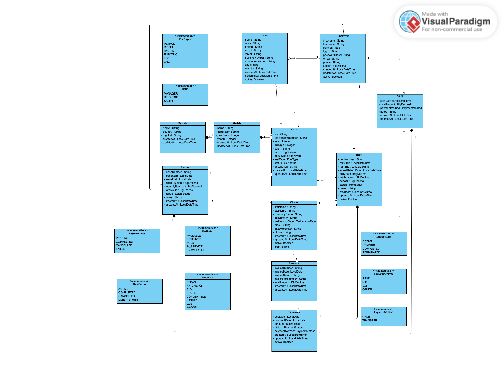
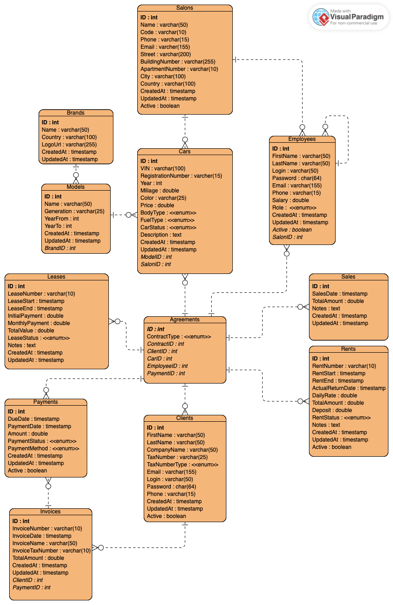

# Car Dealership Management System

A comprehensive web-based information system for car dealership management, built with REST API architecture and UML modeling.

## Introduction

Information systems are now widely used in business operations to support operational and management processes. For car dealerships, this includes managing vehicle inventory, customer service, and processing sales, leasing, and rental transactions. Performing these processes without IT system support is insufficient from the perspective of efficiency and operational control.

In practice, many car dealerships do not have a single, integrated information system that handles all key processes. Data on vehicles, customers, and transactions is often scattered across different tools or partially maintained manually. This way of working makes it difficult to control operations, increases the risk of errors, and extends customer service time.

The main goal of this project is to design and implement an information system supporting car dealership operations, based on REST API architecture and UML modeling, which solves the problem of dispersed and inconsistent management of vehicle, customer, and transaction data. The system aims to automate key business processes, centralize information, and increase work efficiency by reducing errors resulting from manual data handling.

The system is divided into two main access zones:
- **Public Module** - allows customers to browse the current vehicle offer and view technical specifications without logging in
- **Employee Module** - available after authorization, intended for dealership staff, enabling management of vehicles, customers, employees, and processing of sales, leasing, and rental transactions

## Overview

This system was developed as an engineering diploma thesis at Warsaw University of Technology (WIT). It provides a complete solution for managing car dealership operations including vehicle inventory, customer relations, and transaction processing (sales, leasing, rentals).

**Author:** Oleksii Mamrenko
**Academic Year:** 2025/2026

## Features

### Public Module (No authentication required)
- Browse available vehicles with advanced filtering and sorting
- View detailed car specifications and availability
- Check vehicle locations across dealership branches

### Employee Module (Authentication required)
- **Vehicle Management:** Add, edit, delete vehicles; manage inventory status
- **Customer Management:** Register clients, edit data, view transaction history
- **Transaction Processing:** Handle sales, leasing, and rental agreements
- **Payment Management:** Register and track payments
- **Employee Management:** Create accounts, assign roles (Director only)
- **Reporting:** Generate sales statistics and fleet reports

## Technology Stack

| Layer | Technology |
|-------|------------|
| Backend | Java 17, Spring Boot 3.5.4 |
| Security | Spring Security |
| Database | PostgreSQL |
| ORM | Spring Data JPA, Hibernate |
| Migrations | Flyway |
| Template Engine | Thymeleaf |
| Build Tool | Maven |

## Architecture

The system follows a multi-layered architecture pattern:

```
┌─────────────────────────────────────────────────┐
│              Presentation Layer                 │
│         (Thymeleaf Templates + REST)            │
├─────────────────────────────────────────────────┤
│              Controller Layer                   │
│         (HTTP Request Handling)                 │
├─────────────────────────────────────────────────┤
│               Service Layer                     │
│          (Business Logic)                       │
├─────────────────────────────────────────────────┤
│              Repository Layer                   │
│         (Data Access - JPA)                     │
├─────────────────────────────────────────────────┤
│               Database Layer                    │
│            (PostgreSQL)                         │
└─────────────────────────────────────────────────┘
```

## UML Diagrams

### Use Case Diagram


### Class Diagram


### ERD (Entity Relationship Diagram)


## Project Structure

```
src/
├── main/
│   ├── java/thesis/Graduation/thesis/
│   │   ├── config/          # Security, Web, Flyway configuration
│   │   ├── controller/      # REST controllers
│   │   ├── entity/          # JPA entities and enums
│   │   ├── repository/      # Data access interfaces
│   │   └── service/         # Business logic
│   └── resources/
│       ├── db/              # Flyway migrations
│       ├── static/          # CSS, JS assets
│       ├── templates/       # Thymeleaf templates
│       └── application.yaml # Application configuration
└── test/                    # Unit and integration tests
```

## User Roles and Permissions

| Role | Permissions |
|------|-------------|
| **Seller** | Register sales/rentals/leases, view vehicles, register payments |
| **Manager** | All Seller permissions + add/edit vehicles, manage vehicle status, view reports |
| **Director** | All Manager permissions + manage employees, assign roles, full system access |

## Prerequisites

- Java 17+
- Maven 3.6+
- PostgreSQL 12+

## Installation

1. **Clone the repository**
   ```bash
   git clone https://github.com/yourusername/Graduation-thesis.git
   cd Graduation-thesis
   ```

2. **Set up the database**
   ```sql
   CREATE DATABASE car_dealership;
   ```

3. **Configure environment variables**

   Copy `.env.example` to `.env` and fill in your values:
   ```bash
   cp .env.example .env
   ```

   Edit `.env` file:
   ```properties
   # Database Configuration
   DB_URL=jdbc:postgresql://localhost:5432/car_dealership
   DB_USERNAME=your_db_username
   DB_PASSWORD=your_db_password

   # Server Configuration
   SERVER_ADDRESS=0.0.0.0
   SERVER_PORT=8080

   # Security Configuration
   SECURITY_USER_NAME=admin
   SECURITY_USER_PASSWORD=your_secure_password
   ```

4. **Build the project**
   ```bash
   ./mvnw clean install
   ```

5. **Run the application**
   ```bash
   ./mvnw spring-boot:run
   ```

6. **Access the application**
   - Public module: `http://localhost:8080`
   - Employee login: `http://localhost:8080/login`

## API Endpoints

### Public Endpoints

| Method | Endpoint | Description |
|--------|----------|-------------|
| GET | `/cars` | List vehicles with filtering |
| GET | `/cars/{id}` | Vehicle details |
| GET | `/salons` | List dealership branches |
| GET | `/brands` | List car brands |
| GET | `/models` | List car models |

### Vehicles Management

| Method | Endpoint | Description | Access |
|--------|----------|-------------|--------|
| POST | `/cars` | Add vehicle | Seller, Manager, Director |
| PUT | `/cars/{id}` | Edit vehicle | Manager, Director |
| PATCH | `/cars/{id}/status` | Change status | Seller, Manager, Director |
| DELETE | `/cars/{id}` | Delete vehicle | Director |

### Clients Management

| Method | Endpoint | Description | Access |
|--------|----------|-------------|--------|
| GET | `/clients` | List clients | Seller, Manager, Director |
| POST | `/clients` | Register client | Seller, Manager, Director |
| PUT | `/clients/{id}` | Edit client | Seller, Manager, Director |
| DELETE | `/clients/{id}` | Deactivate client | Director |

### Employees Management

| Method | Endpoint | Description | Access |
|--------|----------|-------------|--------|
| GET | `/employees` | List employees | Director |
| POST | `/employees` | Create account | Director |
| PUT | `/employees/{id}` | Edit employee | Director |
| DELETE | `/employees/{id}` | Deactivate account | Director |

### Sales

| Method | Endpoint | Description | Access |
|--------|----------|-------------|--------|
| GET | `/sales` | List transactions | Seller, Manager, Director |
| POST | `/sales` | Register sale | Seller, Manager, Director |
| GET | `/sales/{id}` | Transaction details | Seller, Manager, Director |
| DELETE | `/sales/{id}` | Cancel sale | Manager, Director |

### Rentals

| Method | Endpoint | Description | Access |
|--------|----------|-------------|--------|
| GET | `/rents` | List rentals | Seller, Manager, Director |
| POST | `/rents` | Register rental | Seller, Manager, Director |
| PATCH | `/rents/{id}` | Return vehicle | Seller, Manager, Director |
| DELETE | `/rents/{id}` | Delete rental | Director |

### Leases

| Method | Endpoint | Description | Access |
|--------|----------|-------------|--------|
| GET | `/leases` | List leases | Seller, Manager, Director |
| POST | `/leases` | Register lease | Seller, Manager, Director |
| PUT | `/leases/{id}` | Update lease | Manager, Director |
| DELETE | `/leases/{id}` | Delete lease | Director |

### Payments

| Method | Endpoint | Description | Access |
|--------|----------|-------------|--------|
| GET | `/payments` | List payments | Seller, Manager, Director |
| POST | `/payments` | Register payment | Seller, Manager, Director |
| PATCH | `/payments/{id}` | Change status | Manager, Director |

### Authentication

| Method | Endpoint | Description |
|--------|----------|-------------|
| POST | `/login` | User login |
| POST | `/logout` | User logout |

## Database Schema

The system uses the following main entities:

| Entity | Description |
|--------|-------------|
| **Brands** | Vehicle manufacturers |
| **Models** | Vehicle models (linked to brands) |
| **Cars** | Individual vehicle records |
| **Salons** | Dealership branches |
| **Clients** | Customer records |
| **Employees** | Staff accounts with roles |
| **Agreements** | Base transaction entity |
| **Sales** | Vehicle sales records |
| **Leases** | Leasing agreements |
| **Rents** | Rental agreements |
| **Invoices** | Financial documents |
| **Payments** | Payment records |

## Testing

Run tests with:
```bash
./mvnw test
```

## License

This project was developed as part of an engineering diploma thesis at Warsaw University of Technology (WIT).

